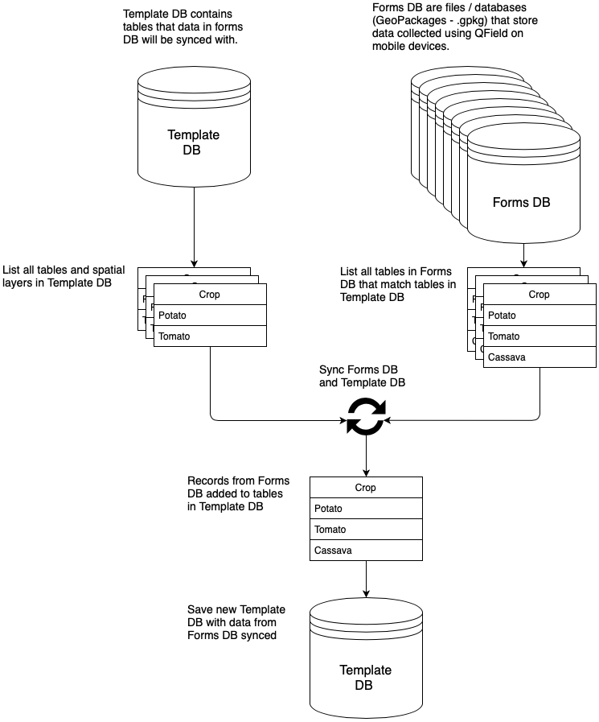
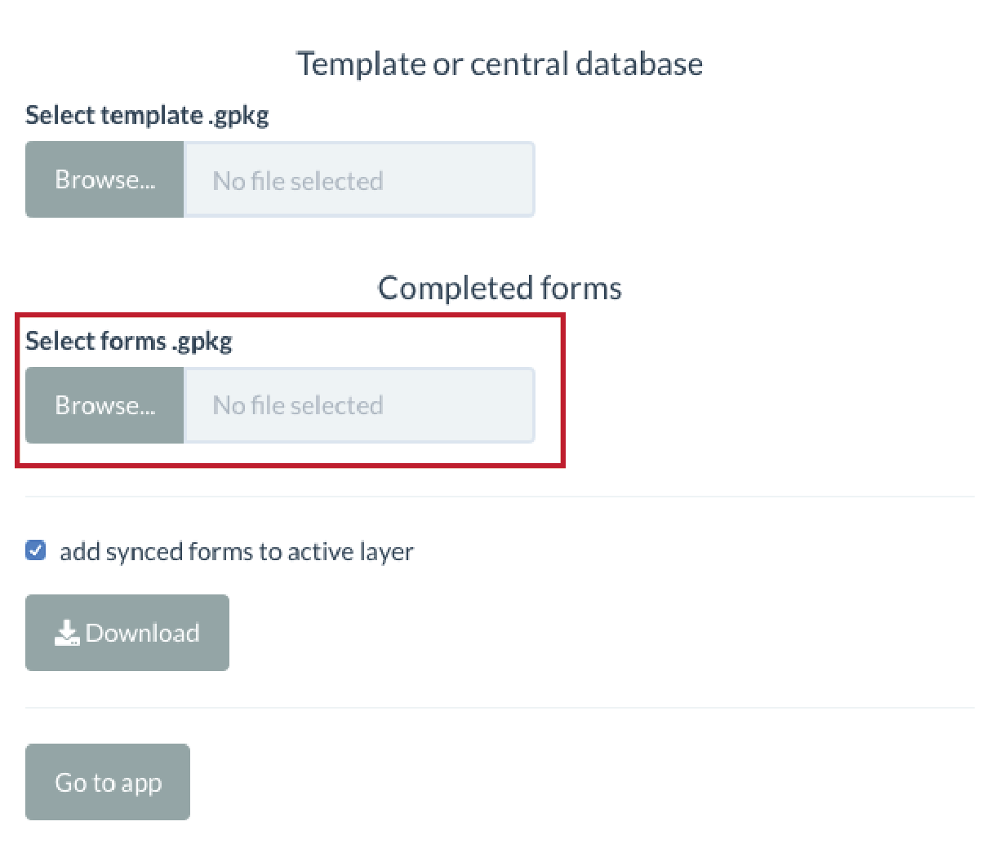

Use the following workflow to sync data collected using forms on multiple mobile devices, or collected on multiple dates, using QField.

### Template Database

Select a template database (GeoPackage file - .gpkg) which will be used to sync newly collected data with. The template database contains the structure (schema) of the database that data collected in the field, using QField, will be combined with. For example, if the project you are using to collect data in QField has crop type, plot boundary, or farm management tables then the template should have corresponding tables where the data will be synced to.

Click the <em>Browse</em> button under <em>Template or central database</em>.

Typically, the template database will either be a database with no records (i.e. before you have collected data in the field and synced it) or a database with all previously collected data synced. You will then sync the data you have collected using QField with the data stored in the template and update it.

### Forms Database

Forms databases are GeoPackage files (.gpkg) that store data collected using the QField mobile GIS. You can select one or more forms to sync with the template database. When you sync data collected using QField (forms) with the template, the app looks for matching tables or layers in each form and the template. If there is a match, the app inserts the data from the form into the corresponding table in template and removes any duplicate records.

Click the <em>Browse</em> button under <em>Completed forms.</em>

Clicking the <em>Download</em> button will download a date- and time-stamped GeoPackage storing the synced data.

Clicking the <em>Go to app</em> button will take you into the dashboard where you can explore the synced data.

