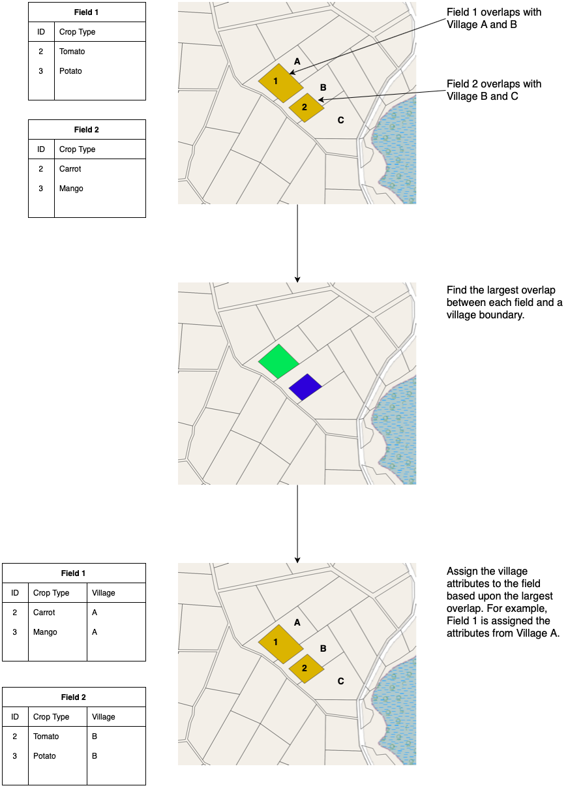
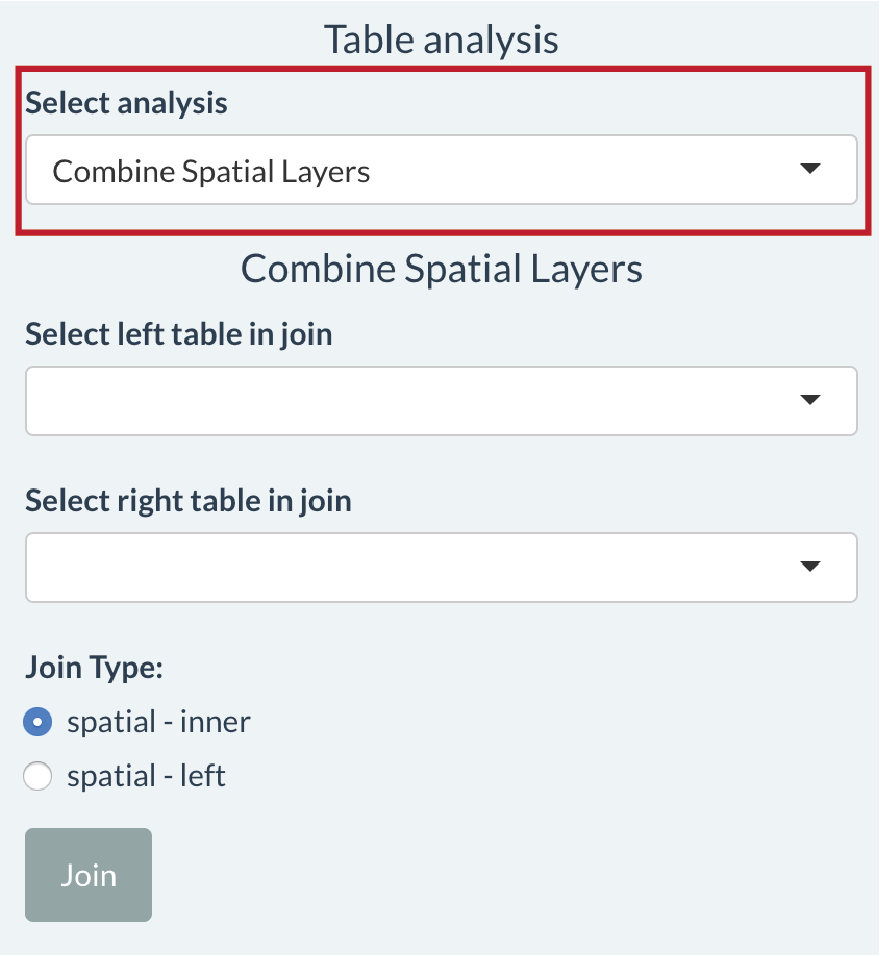

<em>Combine Spatial Layers</em> provides tools for performing spatial joins. A spatial join allows you to combine attributes from two spatial layers based upon the feature’s relationship in space.

A spatial join could be useful in the following scenario: you have been mapping farms using QField and have a spatial layer storing the outline of fields and attributes about each field (e.g. farmer name, fertiliser use etc.). You might want to combine your map of field outlines with another spatial layer (e.g. tax allotment, village boundaries, census boundaries). This would involve assigning attributes in your village boundary layer (e.g. village name, village id) to fields whose outline overlaps with the village extent.

In this app features are joined based on the largest intersection (largest overlap) between two features. If 30% of a field overlapped with Village A and 70% of a field overlapped with Village B, the field would be assigned the attributes of Village B. Another way to think of this is: the field is getting the columns from the table associated with village boundaries with the values coming from the row in village boundaries table associated with the village with the largest overlap with the field.

The following diagram illustrates the process of performing a spatial join using the field-to-village example.

Use the <em>Table analysis</em> tools to select the <em>Combine Spatial Layers</em> option.

Then select the two tables you want to join in the <em>Select left table in join</em> and <em>Select right table join</em> dropdown lists. The columns from the right table will be appended to the right of the left table.

There are two types of join. A <em>spatial – inner</em> join will keep only feature in the left table where there is an overlap with a feature in the right table. A <em>spatial – left</em> join will keep all features in the left table and return an NA in columns from the right table where there is no overlap.

Click the <em>Join</em> button to join the two tables. The result of the Join will appear as a table that can be selected under <em>Select active layer</em> called joined table.

<b>When is this useful?</b> Let’s keep going with the farm mapping example. You might want to compute the area of different crop types grown in each village. If you join your spatial layer of fields (with crop type attributes) to a village boundary layer (with a village name attribute),  you can use the table that is returned from the join to compute the area of each crop in each village.

<b>Where to get spatial layers from?</b> Using the Browse button under <em>Upload data to explore</em> you can add multiple spatial layers to the app that you can use in spatial joins.

