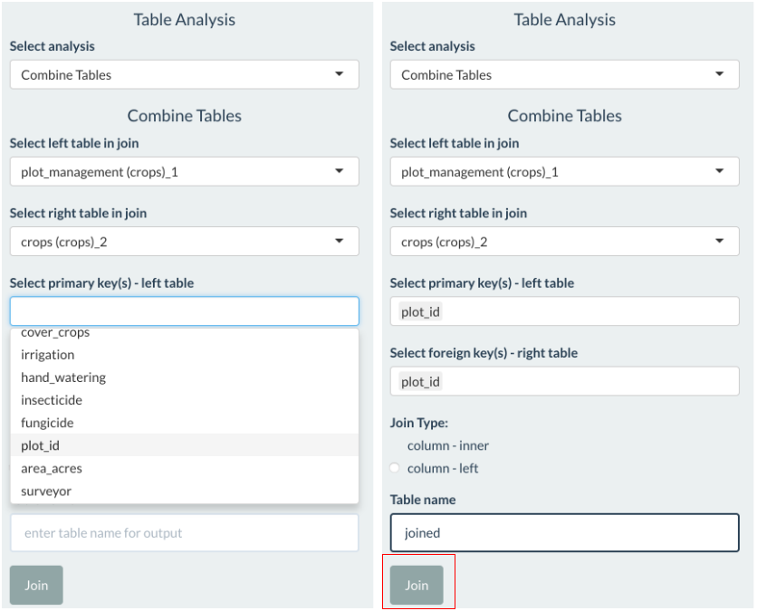

```{r, include = FALSE}
knitr::opts_chunk$set(
  collapse = TRUE,
  comment = "#>"
)
```

## Multifunctional landscapes and livelihoods

### Livelihood diversification

* on-farm - working on household farm
* off-farm - working on someone elses farm (i.e. agricultural labour)
* non-farm - non-farm work (i.e. wage labour in town, fishing)

Barrett, C.B. et al. (2001) Nonfarm income diversification and household livelihood strategies in rural Africa: concepts, dynamics, and policy implications. *Food Policy*, 26(4), 315-331. <a href="https://doi.org/10.1016/S0306-9192(01)00014-8" target="_blank">https://doi.org/10.1016/S0306-9192(01)00014-8</a>.

### Integrated crop-livestock systems

* spatial integration (e.g. mixing crops in a location)
* functional integration (e.g. livestock manure fertilises fields for crops)
* economic integration (e.g. cash generated from selling crops buys livestock feed)

Thornton, P. and Herrero, M. (2015) Adapting to climate change in the mixed crop and livestock farming systems in sub-Saharan Africa. *Nature Climate Change*, 5, 830-836, <a href="https://www.nature.com/articles/nclimate2754" target="_blank">DOI: 10.1038/NCLIMATE2754</a>.

### Cropping systems

* crop succession (more than one year)
* cropping pattern
    * Single cropping
    * Multiple cropping (sequential cropping, intercropping)
* crop management techniques (irrigation, soil tillage, varieties etc.)

Bégué, A. et al. (2018) Remote Sensing and Cropping Practices: A Review. *Remote Sensing*, 10(1), 99, <a href="https://doi.org/10.3390/rs10010099" target="_blank">https://doi.org/10.3390/rs10010099</a>.


*Source:  Bégué et al. (2018)*

## Requirements

* Map farm extents
* Map features within farms (e.g. crop parcels, intercropping, fruit trees)
* Collect attributes about farm management and condition
* Browse geospatial data layers in the field
* Summary tables of crop area and cropping practices by geographic units (for reporting)
* Maps of crops and cropping practices
* Charts of crop area and cropping practices (for reporting)
* Capture cropping systems and diversity
* Easy to use for non-GIS experts
* Operates in low-bandwidth environments

## Workflow

Address requirements by developing a workflow to map farms and record information about farm management and condition.

* **Data collection project** - QGIS dekstop GIS.
* **Field data collection** - QField mobile GIS.
* **Data upload and storage** - ExpressJS server and cloud storage.
* **Data reporting and visualisation** - Spatial dashboard (Shiny).


## Dashboard - explore kava-root crops mixed-cropping systems

Characterise farm diversity using categories (mixed cropping, monocropping, tree-crops) or along a continuum of diversity (e.g. diversity indices).

* Sync data collected on different mobile devices.
* Helper functions for farm monitoring (e.g. compute plant number based on row and plant spacing).

#### Upload data

Upload one or more GeoPackages containing spatial and non-spatial tables. Can upload as a zip file. 

Click `browse` button and upload `crops.gpkg`.


#### Attach spatial information to cropping system information

Use a key-based inner join operation. 

Go to `Table Analysis`.

Select `Combine Tables`. Select `plot_id` as primary and foreign key. 

Give the joined table a name (e.g. `joined`). Click the `Join` button. 




#### Filter rows

Filter the data to keep only kava-root crops mixed-cropping fields. Subset rows of a table based on their values (i.e. area of kava and root crops > 0).

Go to `Table Analysis`.

Select `Filter Rows`. Select `joined` as table to filter.

Click `Filter Options`. 

Copy the below snippet into `Conditions to filter rows`.

```r
(kava_area > 0 & talo_tonga_area > 0) | (kava_area > 0 & talo_futuna_area > 0) | (kava_area > 0 & cassava_area > 0) | (kava_area > 0 & kumala_area > 0) | (kava_area > 0 & kape_area > 0)
```

Give the new filtered table a name: `kava_mixed`.

Click `Filter`.


Check the filter rows operation went OK. Look at available tables in `Select active layer`.


#### Add columns

Create new variables (columns) using values in other columns. 

Compute crop diversity score (Shannon'H). A more diverse field has more crops grown in it and a more even allocation of area among these crops. 

Select `Add Column` in `Table Analysis`.

Select `kava_mixed` as `Table to add new column to`.

Give the new column a name: `crop_div`

Copy the below snippet into `Function to add new column`.

```r
shannon_h_div(kava_area, talo_tonga_area, talo_futuna_area, cassava_area, kumala_area, kape_area)
```

Click `Create Column`.


Repeat the process to compute kava plant density. 

Column name: `kava_dens`

Copy into `Function to add new columns`:

```r
kava_number / kava_area
```

#### Summary tables

Group-by and summarise operations; computes mean, sum, and count for observations in each group. 

Click on the `Data Summary` above the table view.

Select `Summary Tables` in `Table Analysis`.

Select one or more `Grouping variable(s)` to split the data into groups. 

Select one or more `Summarising variable(s)` to summarise within each group.


#### Visualise data - charts

Click the `Charts` tab in the navbar. 

Create histograms, bar plots, and scatter plots. 

Creata a hitogram to show distribution of kava plant density. Select chart options as displayed in the left figure below. Click `draw chart`.

Create a bar plot to show area of kava in different groups of farmer grower status. Select chart options as displayed in the right figure below. Click `draw chart`.


#### Visualise data - web maps

Click the `Map` tab in the navbar. 

Click `Map options` to create a web map visualising crop diversity in kava-root crops mixed systems. 

Use interactive pop-ups to explore attributes of each field. 


